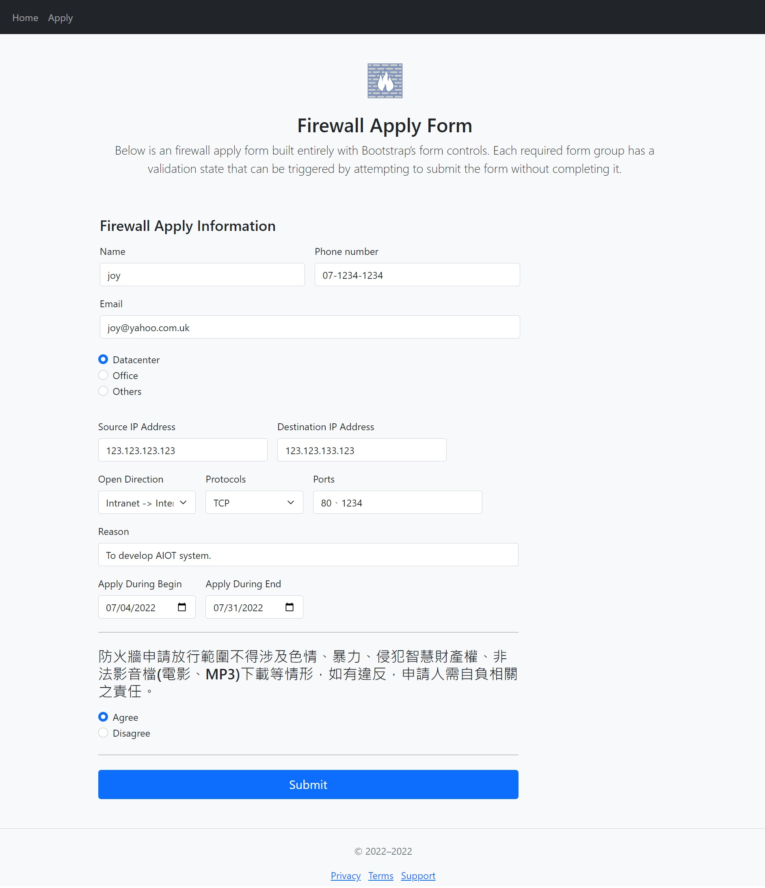
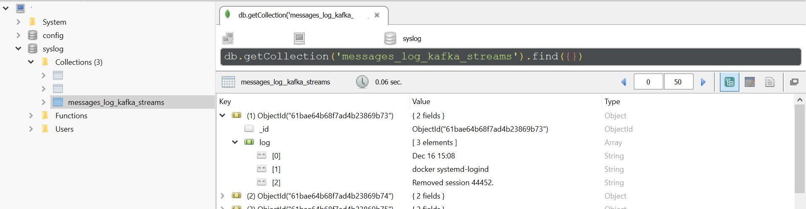

# Analyzing and Modeling RestAPI by flask-jwt-api

## What is it ?

This project uses the bearer token authorization by flask-jwt-api ,and provides RestAPI like this:

- User related feature like login、register、password forgot、password reset.

- File related feature like file upload、file list、file download、file delete.

- analyzing related feature like csv correlation analyze、csv info、histogram plot、diagram plot、scatter plot.

- modeling related feature like build linear regression、multiple regression、polynomial regression、decision tree.

[GitHub](https://github.com/TsungJu/data-analyze-ml-toolset-backend)

[Demo](https://data-analyze-ml-toolset-backend.azurewebsites.net)

# InventoryDemo

This is inventory analyze and management System build by flask and bootstrap.

[GitHub](https://github.com/TsungJu/inventory-demo)

[Demo](https://leoinventorydemo.azurewebsites.net)

# Firewall Apply System

## What is it ?

此專案為部署於Heroku的防火牆開放申請系統，目前提供的功能如下：

 - 防火牆開放申請。
 - 查看目前所有正在處理中的防火牆開放申請。

## How to use ?

1. home頁顯示目前所有正在處理中的防火牆開放申請：

2. 填寫相關防火牆開放，並送出申請：

[GitHub](https://github.com/TsungJu/firewall-apply-system)

[Demo](https://firewall-apply-system.azurewebsites.net/)

# Syslog realtime interpret by kafka streams

## What is it ?

This project uses kafka streams to realtime interpret syslog, and insert to mongoDB. Syslog include message file.

## How to use ?

## 0. Download and unpack kafka_2.13-2.8.0.tgz to get zookeeper, kafka server, connect start shell script and config file.

## 1. Run zookeeper, kafka server, connect, mongoDB, and create topic:

### Monolithic:

$ `bash start-zookeeper-kafka-connect-mongodb.sh`

### Containerized:

$ `docker-compose up -f docker/docker-compose.yml`

## 2. create local file source connector:

### Monolithic:

$ `bash ./syslog-messages/connect-distributed-connector-bin/create-local-file-source-connector.sh`

### Containerized:

$ `bash ./docker/syslog-messages/messages-file-source/start-messages-file-source-connector.sh`

## 3. Run kafka streams:

### Monolithic:

$ `java -cp syslog.realtime.interpret.kafka.streams.messages-0.0.1-SNAPSHOT.jar syslog.realtime.interpret.kafka.streams.messages.LineSplit`

### Containerized:

$ `bash ./docker/syslog-messages/kafka.streams.messages/start-kafka-streams-messages.sh`

## 4. create mongodb sink connector:

### Monolithic:

$ `bash ./syslog-messages/connect-dirtributed-connector-bin/create-mongodb-sink-connector.sh`

### Containerized:

$ `bash ./docker/syslog-messages/messages-mongodb-sink/start-messages-mongodb-sink-connector.sh`

### Login mongoDB checkout:

Address: localhost
Port: 27017

### kafka GUI tool: kafdrop

$ `docker run -it --rm -p 9000:9000 --network host -e KAFKA_BROKERCONNECT=localhost:9092 -e JVM_OPTS="-Xms32M -Xmx64M" -e SERVER_SERVLET_CONTEXTPATH="/" obsidiandynamics/kafdrop:latest`

[GitHub](https://github.com/TsungJu/syslog-realtime-interpret)
