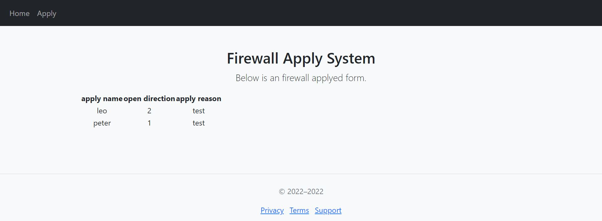
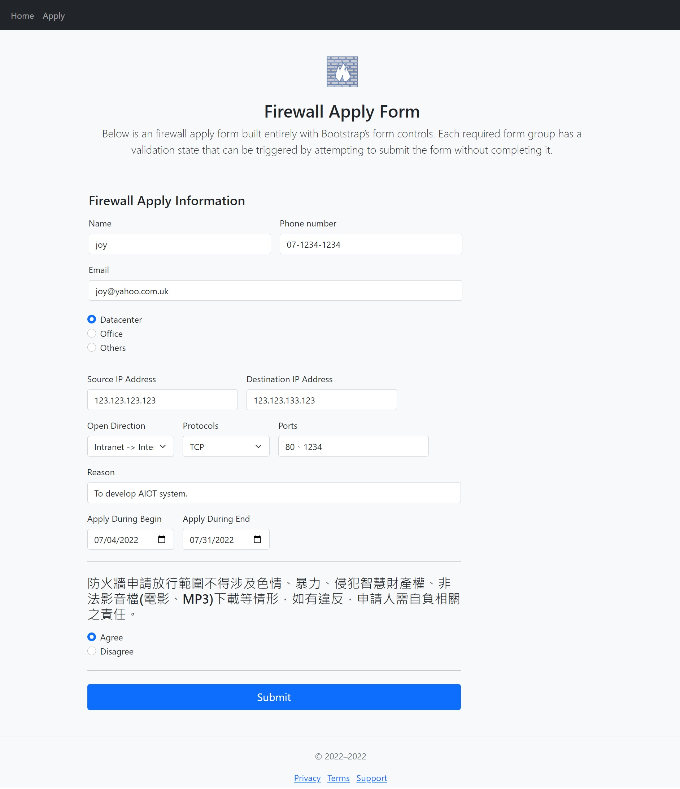

# Analyzing and Modeling RestAPI by flask-jwt-api

## What is it ?

This project uses the bearer token authorization by flask-jwt-api ,and provides RestAPI like this:

- User related feature like login、register、password forgot、password reset.

- File related feature like file upload、file list、file download、file delete.

- analyzing related feature like csv correlation analyze、csv info、histogram plot、diagram plot、scatter plot.

- modeling related feature like build linear regression、multiple regression、polynomial regression、decision tree.

[GitHub](https://github.com/TsungJu/data-analyze-ml-toolset-backend)

[Demo](https://data-analyze-ml-toolset-backend.azurewebsites.net)

# InventoryDemo

This is inventory analyze and management System build by flask and bootstrap.

[GitHub](https://github.com/TsungJu/inventory-demo)

[Demo](https://leoinventorydemo.azurewebsites.net)

# Firewall Apply System

## What is it ?

此專案為部署於Heroku的防火牆開放申請系統，目前提供的功能如下：

 - 防火牆開放申請。
 - 查看目前所有正在處理中的防火牆開放申請。

## How to use ?

1. home頁顯示目前所有正在處理中的防火牆開放申請：

2. 填寫相關防火牆開放，並送出申請：

[GitHub](https://github.com/TsungJu/firewall-apply-system)

[Demo](https://firewall-apply-system.azurewebsites.net/)
